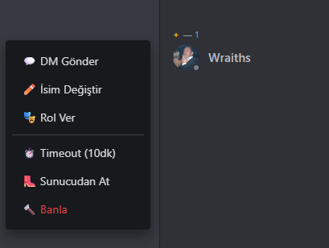

# Discord Bot Client

A modern and powerful Discord bot management interface. Manage your Discord bot, message, and monitor your servers from your browser.


## 📸 Ekran Görüntüleri

<div align="center">
  
  <br/><br/>
  
  <br/><br/>
  
  <br/><br/>
  
</div>

## ✨ Features

### 💬 Messaging
- Message reactions
- DM (Direct Message) support
- Viewing message history

### 👥 Member Management
- Member list and roles
- Online/Offline status
- Member activities
- Member actions: - Sending DMs - Changing name - Assigning roles - Timeout
- Kick
- Ban

## 🚀 Installation

### Requirements
- Node.js 18 or higher
- Discord Bot Token

### Steps

1. Clone the project:
```bash
git clone <repo-url>
cd discord-bot-client
```
2. Install dependencies:
```bash
npm install
```
3. Start the development server:
```bash
npm run dev
```
4. Open in browser:
```
http://localhost:3000
```

## 🔧 Usage

### Obtaining Bot Token

1. Go to the [Discord Developer Portal](https://discord.com/developers/applications)
2. Click the "New Application" button
3. Go to the "Bot" tab in the left menu
4. Click the "Reset Token" button
5. Copy the token

### Bot Permissions

Your bot must have the following permissions:
- Read Messages/View Channels
- Send Messages
- Manage Messages
- Read Message History
- Add Reactions
- Kick Members
- Ban Members
- Manage Nicknames
- Manage Roles

### Logging In

1. Open the application
2. Enter your bot token
3. Click the "Log In" button
4. Your servers will be automatically loaded

## 📁 Proje Yapısı

```
discord-bot-client/
├── app/ # Next.js App Router
│ ├── api/ # API Routes
│ │ ├── channels/ # Channel operations
│ │ ├── dms/ # DM operations
│ │ ├── guilds/ # Server operations
│ │ ├── login/ # Login
│ │ └── members/ # Member operations
│ ├── globals.css # Global styles
│ ├── layout.tsx # Main layout
│ └── page.tsx # Homepage
├── components/ # React components
│ ├── ChatPanel.tsx # Messaging panel
│ ├── ChannelsPanel.tsx # Channel list
│ ├── LoginScreen.tsx # Login screen
│ ├── MainScreen.tsx # Main screen
│ └── MembersPanel.tsx # Member list
├── lib/ # Helper libraries
│ └── discord-client.ts # Discord.js client
├── server.js # WebSocket server
├── next.config.js # Next.js configuration
└── package.json # Dependencies
```

## 🛠️ Technologies

- **Next.js 14** - React framework
- **React 18** - UI library
- **TypeScript** - Type safety
- **Discord.js** - Discord API
- **WebSocket** - Real-time communication
- **CSS Modules** - Modular style management

## 📝 Feature Details

### Real-Time Messaging
Messages are updated instantly using WebSocket. No page refresh is required.

### Token Recall
After logging in, the token is stored in localStorage. Automatic login is performed when the page is refreshed.

### Member Menu
You can perform actions on members both from the member list and from usernames in messages.

### DM System
You can view all DMs sent to the bot by clicking the Home button.

## License

This project is licensed under the Apache-2.0 license.

## 📞 Contact

For your questions, you can get support from https://discord.gg/vsc

---

⭐ Projeyi beğendiyseniz yıldız vermeyi unutmayın!
