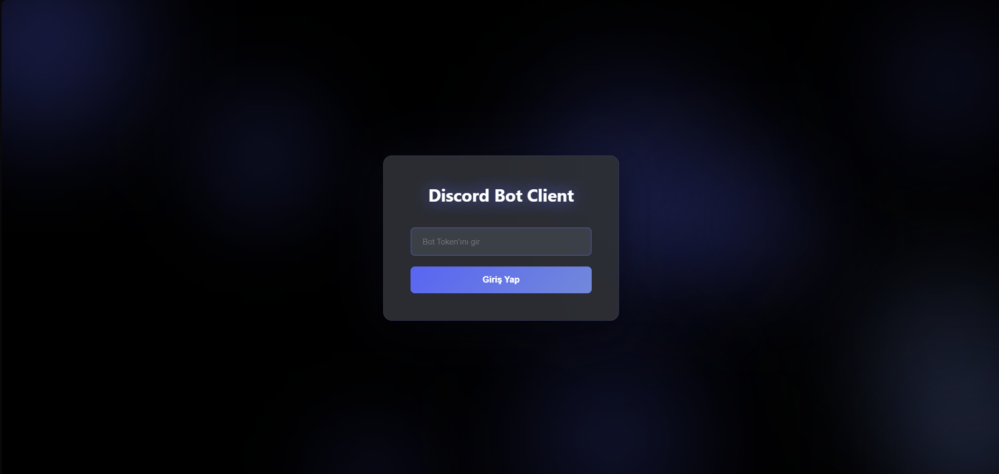
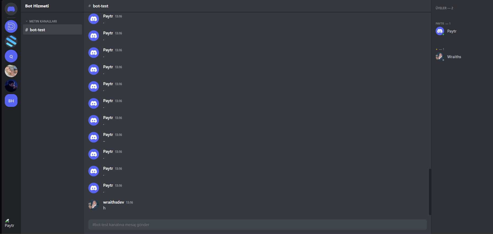
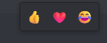

# Discord Bot Client

Modern ve güçlü Discord bot yönetim arayüzü. Discord botunuzu tarayıcıdan yönetin, mesajlaşın ve sunucularınızı kontrol edin.


## 📸 Ekran Görüntüleri

<div align="center">
  
  <br/><br/>
  
  <br/><br/>
  
  <br/><br/>
  
</div>

## ✨ Özellikler

### 💬 Mesajlaşma
- Mesaj tepkileri (reactions)
- DM (Direkt Mesaj) desteği
- Mesaj geçmişi görüntüleme

### 👥 Üye Yönetimi
- Üye listesi ve rolleri
- Online/Offline durumları
- Üye aktiviteleri
- Üye işlemleri:
  - DM gönderme
  - İsim değiştirme
  - Rol verme
  - Timeout
  - Kick
  - Ban

## 🚀 Kurulum

### Gereksinimler
- Node.js 18 veya üzeri
- Discord Bot Token

### Adımlar

1. Projeyi klonlayın:
```bash
git clone <repo-url>
cd discord-bot-client
```

2. Bağımlılıkları yükleyin:
```bash
npm install
```

3. Geliştirme sunucusunu başlatın:
```bash
npm run dev
```

4. Tarayıcıda açın:
```
http://localhost:3000
```

## 🔧 Kullanım

### Bot Token Alma

1. [Discord Developer Portal](https://discord.com/developers/applications)'a gidin
2. "New Application" butonuna tıklayın
3. Sol menüden "Bot" sekmesine gidin
4. "Reset Token" butonuna tıklayın
5. Token'ı kopyalayın

### Bot İzinleri

Botunuzun aşağıdaki izinlere sahip olması gerekir:
- Read Messages/View Channels
- Send Messages
- Manage Messages
- Read Message History
- Add Reactions
- Kick Members
- Ban Members
- Manage Nicknames
- Manage Roles

### Giriş Yapma

1. Uygulamayı açın
2. Bot token'ınızı girin
3. "Giriş Yap" butonuna tıklayın
4. Sunucularınız otomatik olarak yüklenecektir

## 📁 Proje Yapısı

```
discord-bot-client/
├── app/                      # Next.js App Router
│   ├── api/                  # API Routes
│   │   ├── channels/         # Kanal işlemleri
│   │   ├── dms/              # DM işlemleri
│   │   ├── guilds/           # Sunucu işlemleri
│   │   ├── login/            # Giriş
│   │   └── members/          # Üye işlemleri
│   ├── globals.css           # Global stiller
│   ├── layout.tsx            # Ana layout
│   └── page.tsx              # Ana sayfa
├── components/               # React bileşenleri
│   ├── ChatPanel.tsx         # Mesajlaşma paneli
│   ├── ChannelsPanel.tsx     # Kanal listesi
│   ├── LoginScreen.tsx       # Giriş ekranı
│   ├── MainScreen.tsx        # Ana ekran
│   └── MembersPanel.tsx      # Üye listesi
├── lib/                      # Yardımcı kütüphaneler
│   └── discord-client.ts     # Discord.js client
├── server.js                 # WebSocket sunucusu
├── next.config.js            # Next.js yapılandırması
└── package.json              # Bağımlılıklar
```

## 🛠️ Teknolojiler

- **Next.js 14** - React framework
- **React 18** - UI kütüphanesi
- **TypeScript** - Tip güvenliği
- **Discord.js** - Discord API
- **WebSocket** - Gerçek zamanlı iletişim
- **CSS Modules** - Modüler stil yönetimi

## 📝 Özellik Detayları

### Gerçek Zamanlı Mesajlaşma
WebSocket kullanarak mesajlar anında güncellenir. Sayfa yenilemeye gerek yoktur.

### Token Hatırlama
Giriş yaptıktan sonra token localStorage'da saklanır. Sayfa yenilendiğinde otomatik giriş yapılır.

### Üye Menüsü
Hem üye listesinden hem de mesajlardaki kullanıcı isimlerinden üyelere işlem yapabilirsiniz.

### DM Sistemi
Ana Sayfa butonuna tıklayarak bota gönderilen tüm DM'leri görüntüleyebilirsiniz.

## � Liesans

Bu proje MIT lisansı altında lisanslanmıştır.

## 📞 İletişim

Sorularınız için https://discord.gg/vsc adresinden destek alabilirsiniz.

---

⭐ Projeyi beğendiyseniz yıldız vermeyi unutmayın!